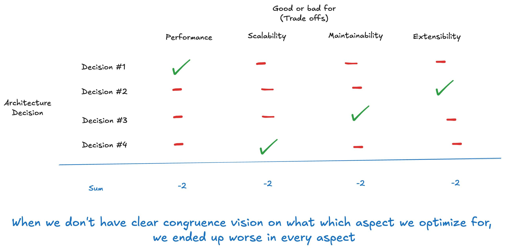

One thing that I think people who interested in software architecture don’t talk about enough is Architecture Congruency. Or in other words, how consistent or aligned the architecture is.

Here’s the thing: every architectural decision in the world comes with its own trade-offs. For example, we might not choose the network connection with the lowest latency because we need to pass through certain security layers. Or we might not choose the cheapest cloud provider because the level of support is insufficient (or we don’t want to host our own servers).

Everything in the world of software architecture is set of trade-offs.

But then comes the big question that every architect has to be able to answer:

What are we making those trade-offs for?

Because every design decision always comes with gains and losses.

---

One issues I often see—whether through reading architectural decisions, articles, or in real-world projects is something I call incongruency.

And generally speaking, it looks like this

In many systems, when we look back at the decisions made, we might see that one was good for performance, another for extensibility, another for scalability, and yet another for maintainability.

But when we put it all together—the system ends up failing across the board.

Here’s a quick example that might help paint the picture more clearly:

“I chose language X because it’s fast—even if it’s hard to write, I’m okay with that.”

Okay, fair enough.

“I chose framework Y for language X because it makes things easier to write and provides a standard, even if it slows things down a bit.”

Still understandable.

But then what if framework Y ends up degrading performance so much that another language would’ve been a better choice altogether?

Wait a minute.

So do we want speed, or do we want ease of development?

What are we really aiming for? Performance, ease of development?

In the end, we’ve made it worse in performance (because of Framework Y) and worse in maintainability (because we’re using language X).

Every step of the way we gain certain good thing, but at the end we make everything worse.

That’s what I call Incongruence.

And I have seen this so many times.

---

I’m not sure if any of you like watching cooking shows, but I love them.

When a chef presents their dish to the judges, they’ll explain what kind of flavor profile they were going for, which ingredients are the stars, which ones play supporting roles, what the dominant tastes are, and what’s meant to be subtle.

If I were to put it in business jargon: every chef has a vision for their dish, for the vision of “deliciousness” they’re aiming for.

And there are billions of types of “deliciousness” in the world. It depends on culture and cuisine. What’s considered delicious in France, Japan, and Thailand are all different.

That vision of "deliciousness" for each dish defines the trade-offs we can make.

For example, if you’re making a steak, and then you make a sauce so delicious and strong that overpowers the meat. It is a complicated sauce with a lot of ingredient and even have some other meat include as well. The sauce have a chicken and fish fillet into it.

Sure, some people might still like it. I’m not denying that there are billions of ways to define “delicious.”

But at that point, can you really call it a steak. Or is it a special stew with a grilled ribeye on top of it?

It's not enough to be just delicious in anyway possible.

There is a certain vision of what a steak should be when you are making steak.

Since you are making a steak, there are certain trade-offs that you would not make even if it make the dish more delicious to some person, because at that point it is not a steak anymore.

Now back to the domain of software architecture.

First thing: What are you really building? Are you having a kind of vision of what good looks like?

If we intentionally want to build a “High-performance web server in Python”.

Let’s say we name it PyRush. That vision and identity will gives us a frame.

For example:

We’re going to use Python.

We’ll write things in the fastest way possible and eliminate waste.

If there’s a technique to make it easier to maintain PyRush but it compromises performance, then that technique better have very very very low impact on performance and very very high gain in maintainability.

That kind of frame sets clear boundaries.

Second question: Do we understand that vision?

Because every decision we make should align with that vision, not just flip-flop because someone says, “Hey, contributing to this is hard,” and we decide to switch to a simple, unoptimized algorithm just for the sake of readability.

And similar to a steak. If someone says, “why don't we make sauce tastier and stronger?”, we can push back that it is not a steak anymore.

When people ask why PyRush don't have this and that, and sometimes it goes out of the vision.

We’d just say:

“If that’s what you’re looking for, go use Django.”

---

So if you’re running into a situation where every architectural decision seems reasonable on its own—but the system as a whole feels weird, inconsistent, like a mixed bag—

Try checking for congruency.

Do you have a vision? And are your decisions aligned with that vision?

When working in design architecture of big systems, so many times people are vouching for what they know best and care the most.

"We should put more performance consideration"

"We hould have more security"

"We should do more [insert good things here]"

and as an architect, if you are not careful about vision and congruency, here what you will ended up with.

And having a vision of what good looks like, is a very crucial soft skill of designing good software architecture that too many engineer overlook.

Software architecture problem today is not like 10 years ago. 10 years ago software architecture is more about coming up with feasible architecture, just one and then do it.

Nowadays is there are million feasible way to build an e-commerce site. It is now more about choosing the fitting one.

I mean nowadays, if someone want to build an ecommerce website with certain technical non-functional requirement: TPS, Resilency, Performance, Avaiability. You can basically build it with any technology stack.

You can use Ruby, suffer the server cost while gaining maintainability. You can use C++ or Rust and deal with all ownership stuff while gaining optimal speed. You can even use PHP and it is doable, but it comes to certain downside.

But how can you choose which one? Are you just tossing coin or do a lucky draw.

It is one of the art for good software architect to answer this question

Which trade-offs really matter?

Business can only give requirement and vague words of business direction. How can you extract and understand trade-offs that matter?

Do you have enough listening skill and empathy to extract that and understand that? Even when the vision they are aiming for is not something you might inherently care about the most?

And this go way beyond hard skill understanding math, distributing system, system design interview and all that stuff.

I have been in so many situation where what I value when I build software for myself is not congruence with the software we build and direction we want to go, and it required totally different way approach.

I really love domain-driven design but I also totally empathize with the software vision that is anti-thesis of domain driven design itself. Like, many business workflow sofware aim to be so global, flexible and applicable to every type of business. But then in order to do that domain need to adopt software language instead.

Since it's aim to be applicable for more than 10 domains, the vision itself is not congruence with domain-driven design that I really love.

And as an architect I need to be able to let that go instead of saying "Domain-driven equals good design. Domain-driven design is the best practices!!".

And it is not just thinking, it is about empathizing and be into that vision.

And I think we as a software industry, should acknowledge and be aware of importance of this kind of skill. We should top pretending that architecture is all about knowing good pattern and engineering, finding the "right optimal choice".

Right optimal choice is only right and optimal when it is congruence with the vision. There is no one single right way to build e-commerce, cache, database, message queue, etc. It is up to the vision, which define what matter.

Aside from knowing enough to make a smart high-gain, low-cost architectural trade-offs, good architect need to understand which trade-offs truly matter.

I open a local Thai software architecture class to teach young programmer in my country about this particular question and skillset. But that would not be applicable to global reader anyway.
