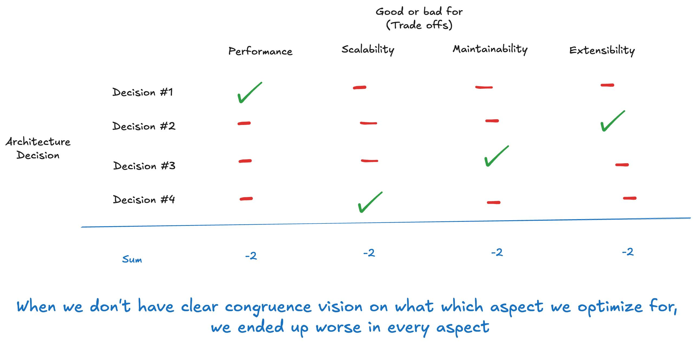

เรื่องนึงที่คนทำ Software Architecture ไม่ได้พูดถึงกันมากเท่าที่ควร คือเรื่อง Architecture Congruency หรือความสอดคล้องของ Architecture

เรื่องมันมีอยู่ว่า จริงๆ แล้วการทำ Architecture decision ทุกอย่างในโลกล้วนมี Trade-offs ของมันเอง อย่างเราอาจจะไม่ได้เลือกวิธีการเชื่อม Network ตรงที่มันมี Latency น้อยที่สุด เพราะมันต้องมีการกรอง Security บางอย่าง หรือเราอาจจะไม่ได้เลือก Cloud provider ที่ถูกที่สุดเพราะระดับการ Support มันไม่พอ (หรือเราไม่เลือกตั้งเซิฟเอง)

ทุกอย่างใดๆ ในโลก Software Architect ล้วนเป็น Trade-offs

แต่ที่นี้คำถามใหญ่ที่นักออกแบบ Architect จะต้องตอบให้ได้คือ เรา Trade-offs เพื่อมุ่งไปสู่อะไรกันแน่

เพราะทุกๆ Design decision มันมีของที่ได้มาและของที่เสียไปเสมอ

---

ประเด็นรูปแบบนึงที่ผมเจอบ่อยมากจากทั้งการอ่าน Architecture decision, Article หรือทำงานจริง คือ Incongruency หรือแปลเป็นไทยว่าความไม่สอดคล้อง

ซึ่งภาพมันจะออกมาเป็นแบบนี้

หลายๆ ในระบบนึง พอเราย้อนกลับไปดู การตัดสินใจอันนึงมันอาจจะดีในแง่ของ Performance อีกอันนึงอาจจะดีในแง่ของ Extensibility อีกอันนึงอาจจะดีในแง่ของ Scalability และอีกอันอาจจะดีในแง่ของ Maintainability

แต่พอรวมๆ กัน ทุกอย่างติดลบหมดเลย

ถ้าผมเอาตัวอย่างที่อาจจะทำให้เห็นภาพได้เร็วที่สุด ก็คงจะมีแบบนี้

"ผมเลือก C++ เพราะมันเร็วถึงจะเขียนยากหน่อยก็ยอมแหละ" - โอเค เข้าใจได้

"ผมเลือก Framework X นี้ใน C++ เพราะมันช่วยให้เขียนง่ายมีมาตรฐาน อาจจะช้าบางก็ยอม ยังไงก็โปรแกรมเมอร์ก็ต้องทำงานได้" - ก็โอเค เข้าใจได้

แต่แล้วถ้า Framework X ตัวนี้สุดท้ายมันทำให้ Performance ของระบบต่ำมากจนกระทั่งใช้ภาษาอื่นดีกว่าล่ะครับ

อ้าวววว เฮ้ยยยยย ตกลงเราจะเอาเร็ว หรือจะเอาเขียนง่ายล่ะเนี่ย

ตกลงระบบมันเป็นอะไร จะเอาอะไรกันแน่

สุดท้ายกลายเป็นเราได้ Worse in performance (เพราะ Framework X) & Worse in maintainability (เพราะเป็น C++)

และสิ่งนี้แหละที่ผมเรียกว่า Incongruence หรือความไม่สอดคล้อง

---

แล้วเราจะทำยังไงกับเรื่องแบบนี้

ผมไม่รู้ว่าใครชอบดูรายการอาหารมั้ย แต่ผมชอบมากเลย

เวลาที่เชฟออกมาพรีเซนต์จานอาหารของตัวเองให้กรรมการ เขาจะบอกว่า อาหารจานนี้ตั้งใจให้รสออกมาเป็นอะไร วัตถุดิบไหนเป็นตัวชูโรง ตัวไหนเป็นตัวเสริมรส อะไรเป็นรสหลัก อะไรเป็นรสซ่อนเร้น

ถ้าผมพูดเป็นภาษา Business ผมจะบอกว่า เชฟทุกคนมี Vision ในจานอาหารของตัวเอง ว่าอยากให้ "ความอร่อย" มันน่าตายังไง

"ความอร่อย" บนโลกนี้มันมีเป็นพันล้านแบบ ขึ้นกับวัฒนธรรม ประเภทอาหาร อร่อยของฝรั่งเศส ญี่ปุ่น กับไทย ก็ไม่เหมือนกัน

แล้วสิ่งนั้นจะเป็นตัวกำหนดวกรอบคร่าวๆ ว่าอาหารจานนี้มันจะ Trade-offs รสชาติแบบไหน

สมมติเราทำส้มตำปลาร้า การที่แบบรสชาติมะละกอมันกลบรสชาติปลาร้าจนแทบไม่มีกลิ่น มีเปรี้ยวนำแทนเค็ม

อาจจะมีคนชอบมันบ้างก็จริง ไม่เถียง ความอร่อยมีพันล้านแบบ

แต่มันบอกไม่ได้ว่าจานนี้คือ "ส้มตำปลาร้า" อีกต่อไปแล้ว

ภาพสุดท้ายที่ว่าจานนี้คือ "ส้มตำปลาร้า" นั่นแหละคือตัวกำหนดกรอบ

บางคนอาจจะชอบเปรี้ยว ชอบหวาน แต่ความเป็นส้มตำปลาร้ามันจะกำหนดกรอบว่าเราจะไม่ชูโรงรสหวานอร่อย เราจะไม่ซ่อนกินปลาร้า ถึงแม้จะมีคนชอบกินหวานก็ตาม

หรือพูดใน Architect domain มันคือการตัวกำหนดว่า คุณจะ Trade-offs เอาความหวานเกินระดับ X ไม่ได้นะ ต่อให้จะมีคนชอบเยอะขนาดไหนก็เหอะ มันหลุดจาก Vision ของความเป็นส้มตำปลาร้าไปแล้ว มันถึงจุดแล้วที่ว่าคนกลุ่มนี้น่าจะไปสั่งอาหารประเภทอื่นกิน

คุณไปสั่งส้มตำไทยกินแทนเหอะ ถ้าจะชอบเปรี้ยวหวานขนาดนั้น ถ้าจะเกลียดกลิ่นปลาร้าขนาดนั้น

---

ทีนี้กลับมาโดเมนการออกแบบ Software Architect

ข้อแรกคือเรามีการสกัด Vision ตรงนั้นมั้ย

ถ้าเราตั้งใจจะเป็น "High performance web server in Python" สมมติตั้งชื่อใหม่ว่า PyRush มันจะกำหนดกรอบอะไรไว้บ้าง

1. เราจะใช้ภาษา Python
2. เราจะเลือกวิธีการเขียนที่เร็วที่สุด ตัด Waste ให้ได้มากที่สุด
3. ถ้ามันมีวิธีการที่เขียนง่ายขึ้นแต่เสีย Performance มันจะต้องง่ายขึ้นมากๆๆๆๆๆๆๆๆๆๆ และเสีย Performance ไปน้อยมากๆๆๆๆๆๆๆๆ เราถึงจะเลือก

และมันจะมีกรอบอีกมากมายที่ทำให้มันไม่หลุด

ข้อสองคือเราเข้าใจกรอบนี้มั้ย เพราะการตัดสินใจทุกอย่างจะต้องสอดคล้องกับ Vision ที่เราตั้งขึ้น ไม่ใช่อยู่ดีๆ แบบ วันนี้เจอปัญหาคนบ่นว่าเขียนและ Contribute ยากจัง กลายเป็นเรามาใช้ Unoptimized algorithm ที่อ่านง่ายๆ ดีกว่า

และคล้ายๆ กับความเป็นส้มตำปลาร้า ถ้ามีใครบอกว่า ทำไม PyRush มันถึงไม่มี ORM ไม่มีเครื่องมือหลายๆ อย่างที่คนอื่นเขามี

เราก็จะตอบไปว่า ถ้าพี่อยากได้ขนาดนั้น พี่ไป Django เถอะครับ

ดังนั้นถ้าคุณเจอปัญหาว่า Architecture ของคุณมันดูแต่ละการตัดสินใจก็สมเหตุสมผล แต่รวมๆ กันทำไมมันประหลาด ดูจับฉ่าย ดูเอาอะไรไม่ได้

ลองเช็คเรื่อง Congruency ครับ คุณมี Vision และทำงานสอดคล้องกับ Vision มั้ย

---

สุดท้ายช่วงโฆษณา Tie-in

ทีนี้การสร้าง Vision เราจะทำอย่างไรนะ

สิ่งนึงที่เราต้องเข้าใจคือ Vision จะมีความหมายต่อเมื่อมันสอดคล้อง Resonate กับ Human Values บางอย่าง

ในฐานะมนุษย์มีอะไรที่เราให้คุณค่าบ้างล่ะ เยอะแยะไปหมด แต่ตัวอย่างง่ายๆ ก็คือแบบ Scale ได้ Performance ดี ดูแลง่าย ประหยัดต้นทุน

พวกนี้มันคือคุณค่าพื้นฐานที่มนุษย์ไม่ตั้งคำถามว่า "จะมีไปทำไม"

โอเคส่วนตัวคุณอาจจะไม่ได้เป็นคนประหยัดใช่มั้ยครับ แต่เวลาคุณเห็นคนประหยัด คุณไม่งงว่าไอ้หมอนี่มันเป็นบ้าอะไร เป็นมนุษย์ต่างดาวหรือเปล่า

คุณเข้าใจได้ว่าพื้นฐานมนุษย์ทุกคนมีแรงจูงใจทีและแนวโน้มว่าจะประหยัดถ้าทำได้ แม้ตัวคุณอาจจะสุรุ่ยสุร่ายติดหนี้บัตรเครดิเต็มไปหมดอยู่ก็ตามเหอะ

ดังนั้น Vision ถ้ามันสอดคล้องกับ "ความประหยัด" โอเค ไม่ใช่ทุกคนที่ซื้อหรอก บางคนอาจจะบอกว่า Dev productivity สำคัญกว่า ผมต้องการออกฟีเจอร์เร็วๆ ต่อให้ต้นทุน Operation สูงขึ้นก็ยอม

แต่มันเข้าใจได้และมีคนที่ซื้อแน่ๆ

ทั้งหมดนี้คือที่มาของคอร์ส [Humanistic Architecture](https://chrisza.me/course/) ซึ่งเป็นศคอร์สที่ผมเรียกว่าผมสอนเรื่องาน Design อย่างแท้จริง

ในคอร์สนี้ผมพูดถึงศาสตร์ของการ Design Architecture ที่ผมแยกออกมาและคิดว่าคนพูดถึงน้อยมาก คือ Congruency ซึ่งมันจะครอบคลุมถึง

1. การ Design ภาพปลายทางให้มันสอดคล้องกับ Human value
2. การจัดการออกแบบให้สอดคล้องกับภาพปลายทางนั้น ไม่เขวออกไปจากจุดนั้น

และทั้งหมดนี้คือส่วน Design ที่แท้จริง ที่มันแยกออกมาจากการที่ว่า "มี Requirement มาว่างแล้ว คุณจะแก้ปัญหายังไง"

ไอ้ส่วนที่มี Requirement มีความต้องการมาวาง แล้วถามว่า จะใช้ Stack อะไร จะออกแบบแยกระบบยังไงบ้าง มี Pattern แบบไหนที่เหมาะสม อันหลังผมเรียกว่า Solutioning, Problem solving part ครับ ไม่ใช่ส่วนของการ Design

ซึ่งก็เป็นอีกส่วนที่สำคัญของ Architect ครับแต่แค่ในคอร์สผมไม่ครอบคลุม ไปอ่านหรือไปเรียนที่อื่นได้ ผมคิดว่าคนพูดและเขียนหนังสือเยอะ(หรือซักวันผมอาจจะสอนพวกนั้นก็ได้ แต่ตอนนี้ยัง)

แต่เรื่อง Pure Design Part of Software Architecture เนี่ย ผมแทบไม่เคยเห็นใครพูดหรือสอน ผมว่าวันนี้เวลานี้ ผมน่าจะเป็นไม่กี่คนในโลก ที่สอนและพูดเรื่องนี้

ผมบอกในเว็บเนื้อหาคอร์สว่า ถ้าคุณงงว่าระบบ Trade-offs มันมีเยอะๆ คุณเลือกยังไง นี่แหละคือคำตอบแบบคร่าวๆ สร้าง Vision ที่มัน Resonance กับคุณค่ามนุษย์ แล้วทำ Trade-offs ให้สอดคล้องกับสิ่งนี้

แต่ถ้าอยากรู้ลึกกว่านี้ว่าการ Resonance กับ Human value มันมาประสานจนได้ Architecture decision แบบไหน

ก็มาเรียนครับ ปีนี้น่าจะเปิดสองรอบ กลางปีกับปลายปี ได้วันเดี๋ยวผมบอกอีกที

และนี่คือทำไมคอร์ส Software architecture ของผมมันถึงเอาไป Tie-in กับจิตวิทยามนุษย์ได้ มันก็ตรงนี้แหละครับ
