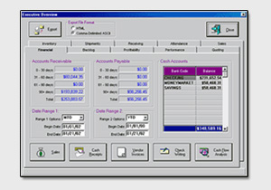

At this moment I see so many apparently veteran developers criticize modern frontend development as being overly and unnecessary complex. And I want to say few things about these criticism.

---

Let start by what I agree with critics

- You don't need any modern frontend framework for building blog or form-based application. This blog itself just using React because I was experiment on Gatsby and I am too lazy to change at this point. I still develop my own course registration system fully in Elixir with server side rendering, not even with LiveView.
- Too many new frontend devs should know more about fundamental of HTML, CSS and vanilla Javascript. There will be nuance to this take later though.
- Too many projects unnecessarily adopt frontend framework inappropriately.
- The whole NPM ecosystem is crazy.
- Keeping up with frontend community these days can be very exhausting. I sympathize with the sentiment.

I will use React as a representation of modern frontend framework, but this also apply equally to others.

Now, let me take on things that I half-agree with:

## Frontend devs should stop learning framework and learn fundamental

I agree with this take but I think too many people don't know what they are asking for when they said this.

What can we realistically expected from graduate developer?

I don't think it is realistic to expect graduate developer to be both good at React and good at web fundamental. When I started out I only know fundamental and need to learn frameworks on the fly (At that time, it was Silverlight, WPF, JQuery, AJAX).

Now we need to realize that if we asked junior developer to be good at fundamental and we are using React, we all have obligation to teach them good React.

It is not realistic to expect graduate to be so wonderful in React they can contribute to React codebase without guidance, and both extremely good at web fundamental (JS, CSS, HTML). That can be senior level in many companies and almost senior in some.

I personally love to coach all these graduate about React and so-on. In fact, I opened React course few times in the past focus on stuff like testing and architecting.

But I'm not sure many senior people who complain about this do, since their opinion on React is like, I won't touch it with ten foot pole.

What do you expect? To work in a company that using React, hire someone who is good at fundamental programming and zero knowledge about React and then learn the framework on the fly and also be productive at day 1?

While it is possible to learn React on the fly, many senior dev understand complexity in JS ecosystem and keep complain about it. Are you expecting graduate to be able to navigate those on their own and be productive?

I agree with this sentiment because I love teaching graduated some more frontend. I would prefer graudate to have strong programming skill and I can walk them through the whole JS ecosystem complexity.

But if you are complaining about not touching frontend with ten foot pole, I'm not sure that you see the end game of this opinion. The end game is that you need to be anchor in frontend world for graduates.

I'm all for this take. I just want to remind you that the end game of this take is that us senior folks need to step up and take care of this.

## Frontend devs keep rediscover and rebrand the old pattern

I agree with this but is this even a thing to complain about?

I always glad when they rediscover the good old pattenrs. It means they’re learning and improving.

The rediscovery of established patterns is a great thing, and I don’t understand why so many developers find it annoying. Do you really want to work with someone who’s completely clueless instead?

And of course, since they’re young, they’ll be excited about it. I mean, I was ecstatic when I first learned to ride a bike or wrote my first running "Hello, World!" program. That’s completely normal.

I don’t know what you expect. Do you want them to be ignorant of these patterns? Do you want them to lose their passion for software development and become jaded from the moment they graduate?

"I learn hundred new patterns today and it feels so boring" - 1st year junior developer.

Do you want to work with this person?

Or do you just want them to endlessly praise the elders, soothe their insecurities, and boost their egos? I don’t get it. When a kid gets excited about learning basic math, I don’t expect them to stop and worship me for knowing it before they did.

Let them have their moment. We don’t need to steal the spotlight from them. It’s healthy for young developers to be enthusiastic. Don’t turn them into jaded devs before their time.

And of course if the pattern is so good they would love to have a reusable tool around. It is pretty obvious.

If you don't want new developer to rebrand tools in web ecosystem based on good old pattern, you can help build one.

I don't think this is not a real argument, it is simply jaded dev envious of youth enthusiastic.

I mean, how can you even turn basically "my kid start to learn some good lessons" to become a bad thing in dev society that need to be fix?

## Most of the work we do don't really required modern frontend stack

I agree with this but I want to add some nuance.

I used to talk about how with all these modern frontend our standard quality of frontend should be much higher. Now it is way way easier to implement things like optimistic updates, conflict-free editing, etc.

It is pretty sad that we are still using modern frontend tech stack with all these reactivity just to build bunch of forms....

I agree with this but my proposal is that we should up our game in frontend development instead of go back to forms + tables + analytics graph. There are so much room to improve.

If you worked in 90s era, do you know that the default "the best UI ever" pattern back then is step-by-step wizard from Microsoft?

I hate this with passion.

Remember PivotTable wizard in Excel? Or create chart wizard? Nowadays those are one-click with sensible default and you can modify any part you don't like on the fly. There is no irreversible decision you did on wizard step 2 out of 10 that you need to recreate the whole thing again anymore.

Instead of going back to those pattern so we can use simpler frontend tool, I think we should up our game in frontend and UI design.

Same agreement: Most of the work today don't really require modern frontend stack.

But I have a different conclusion.

---

And here are takes that I absolutely disagree with

## Frontend back in the day is way simpler.

I have said this in different places.

I did WinForm back in the day and you know what it takes to build just a simple form but with color, gradient, look and feel match brand identity?

You need to buy custom component license just for this (or maybe you can try tweak and play around Win32 rendering engine, but I digress.)

I also worked in early Objective-C and I can't count how many times the language force me to manually type casting. For example: Just a simple table implementation you need to cast NSTableViewDataSource and NSTableViewDelegate to the right custom subtype implementation manually. Because guess what, data source for table will be customized 99% of the time based on what kind of information table need to display.

Don't let me start on early version of LayoutConstraint. Maybe it is better today but to say that frontend development in used to be better than CSS flexbox today: Ridiculous to me.

It really feels like these complainer never do any serious frontend. That's fine and understandable, until they act so snobbish and pretentious.

Frontend in the past is simple because we only build simple frontend. Look at what we used to build

The expectation for frontend development today is way higher than the past.

If you don't like modern frontend design and go back to [motherfuckingwebsite](https://motherfuckingwebsite.com/), fine, that's your personal taste.

But don't pretend there is no value in modern design. In fact, it is known since the beginning of branding theory that having brand identity color increase brand awareness and loyalty.

## Frontend devs are forcing everyone to use modern frontend

I think this is totally misplaced anger.

##

---

As one of the complain I found is basically about "these new frontend devs just keep creating new framework without any basic knowledge of computer programming", so let me explain a little bit of my experience and where I'm coming from.

## Frontend

I used to build frontend in production with these tools:

- WinForm, Visual Studio and C#
- Silverlight application, using good old WPF
- Objective-C
- Swift
- HTML, Javascript, CSS, Jquery
- Built my own mini SPA framework from JQuery
- AngularJS (Angular 1)
- React
- React Native with physics engine
- Vue

And in my little side project, I managed to build and experiment with Phoenix Liveview and HTMX.

## Backend

For production experience:

- Java
- JavaScript & TypeScript
- PHP
- Ruby
- Elixir
- Python
- C#

And for side projects (which you can see in Github):

- Rust (Love it!)
- Scala
- Clojure (love it!)

So you can see that I build program in many paradigm, OOP, functional. I can build a software in a hacky way (thanks PHP) and for payment gateway which accuracy is everything.
