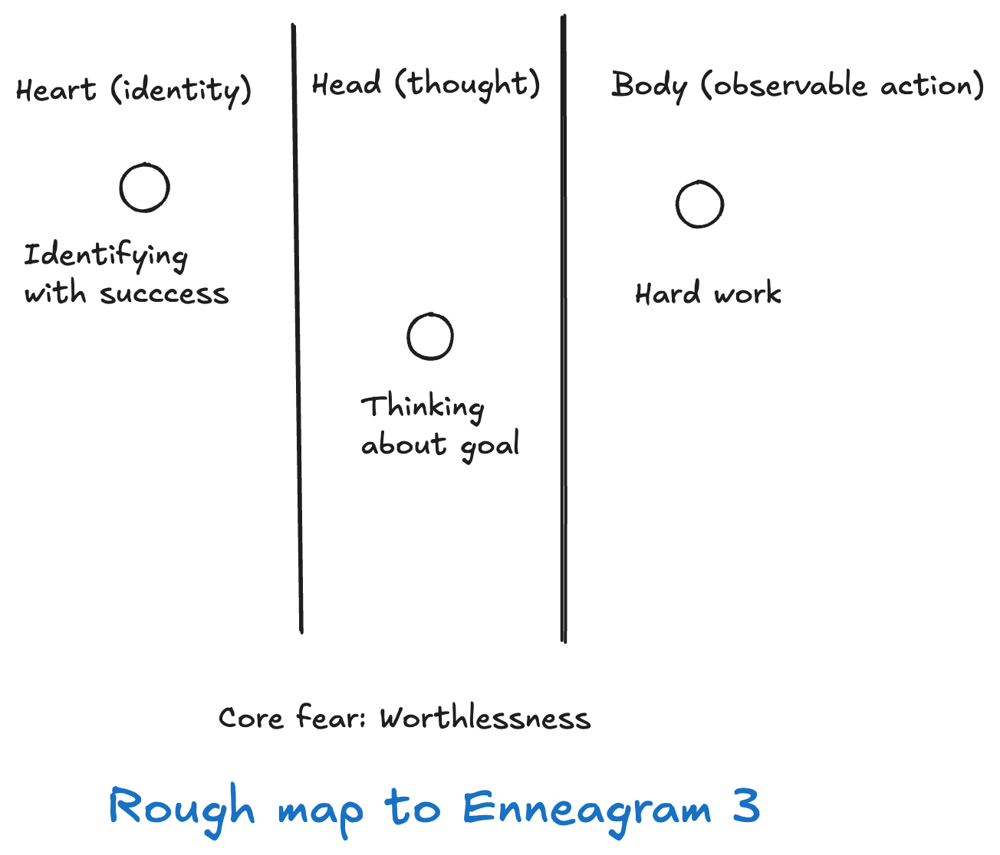

# Part 1: Map, model and reality

## Prelude

It is in my observation that knowing Enneagram well and using Enneagram well is very different topic. I usually say that some people can know Enneagram very well but have no idea how to wield it properly.

I have seen some people only learn about their core type alone without wings, integration, instinct, object relation but they pretty much turning their life around because of that. On the opposite, I have seen people who talk about every Enneagram related theory imaginable and in depth, but yet struggle to get their life together or even fix a very simple relationship problem.

I have seen one of Enneagram teacher who know Enneagram in depth, both in type, instinct, integration, object relation, different authors and sources, etc. He also wrote and translated a lot of books in Thailand. And yet when he started making a workshop to teach Enneagram, many of students just simply walk out. He did not understand how to approach Enneagram topic properly, and made many people hate Enneagram that day. That workshop was advertised to help people growth, yet the same workshop make people hate Enneagram and refuse to growth.

It is very clear that knowing Enneagram well does not mean using Enneagram well.

Many books and resources are focusing on "knowing" part, and talk about type and theory. But very few focus on "using" part, aside from maybe giving some bulleted points of tips and what to do or beware if you are type X.

That is useful, but I think it is not sufficient.

One of the very clear reason why this is not always useful is we know many types are not really motivate to grow by seeing bullet points. While some types might feel like these bullet points are direct, practical and easy to use, some types need underlying reason and choices (ahem: me) to feel motivate. And some types even resist having a book tell them what to do.

And that is why I start writing this guide.

At this point I'm thinking about writing on these topics in this guide

- Intro (this one oe more)
- Using Enneagram for self-discovery
- Using Enneagram to improve quality of relationship
- Using Enneagram to improve communication and presentation (This one maybe or maybe not. I am still thinking wether it is good for both me myself and to the audience to share this at the moment.)

And maybe more, but that's it for now.

## How did I use Enneagram?

Enneagram, essentially, is knowledge. It can be used for many purposes. I can’t say I know how to use the Enneagram in every context and for every purpose, so let me preface how I personally use it. If these are not what you’re looking for, you can skip the whole guide and do something better with your life.

I started studying the Enneagram around 10 years ago, and the first thing I used it for was my romantic relationship. My wife and I started dating at that time, and we had a lot of conflicts and misunderstandings. We fought a lot. We didn’t understand why we were madly in love one day and drove each other crazy the next. Both of us thought deeply about our relationship, and we knew that despite all the conflicts, we loved each other. We tried to make our relationship work. We tried various things, and one of them was attending an Enneagram workshop together.

The Enneagram was one of our attempts to save the relationship and it turned out to be a very impactful and successful one.

When we got married, we sent our personal appreciation and thanks to our Enneagram teachers. They truly saved our relationship, and that relationship has blossomed into the most beautiful thing in our lives.

Today, beyond my romantic relationship, I use the Enneagram for other things as well, such as:

- I do consulting and advisory work in the technology space, involving many heads, directors, and CxOs sometimes from startups and sometimes from large organizations. I still use the Enneagram, combined with many other theories, in this line of work.
- I use parts of the Enneagram in designing software architecture specifically the three centers of intelligence. I’ve used this approach for many years and now teach this unique combination to many technical leaders in Thailand. (For tech folks: the Enneagram can help you understand the design philosophy and motivation behind things like Go, Ruby on Rails, different types of microservices, React vs. Angular, and so on. It would be too long to explain how in this article.)
- I coach and mentor a few programmers and technical leaders, and sometimes I use the Enneagram simply to establish a coaching relationship and frame my thoughts in a way that digestible, truly helps them grow and become more effective. (instead of saying “You’re wrong. Stop doing that. Do this instead.”). Other times, if they’re ready, I teach them the Enneagram directly and show how it applies to the problems they bring to me.

Basically, I’ve adopted the Enneagram in a professional context. And to reiterate a point about knowing vs. using, I had already begun using it to improve both my professional and personal life even before I gained a deeper understanding of instincts and object relations. And I have seen significant progress already.

But if you are looking to use Enneagram in different purposes, such as: manipulation, reinforcing your ego, proving yourselves right and other wrong, and so-on. You can do you, and you can skip this guide completely.

First, I don't like that kind of usage. And second, I don't know how to use it in those ways (or maybe I know how but I refuse to talk about it ¯\\\_(ツ)\_/¯).

In this part, I will talk about some of basic fundamental stuff of using Enneagram. In few next parts, I will talk a little bit more about practical stuff such as self-discovery or relationship.

While I might use some actual concrete type as an example, this guide will not cover detail or description of each type but more of how to use Enneagram theory as a whole.

## Basic of using Enneagram #1: Map and reality

My teachers used to say that the Enneagram is a map of human deep psychology and I think that’s a very good metaphor.

A map does not represent reality. A map is a model. But a map helps us navigate the human mind.

The image above is a map of the Tokyo subway. It’s already quite complicated, but very useful when traveling in Tokyo. It leaves out a lot of real-world details — no cafés, roads, restaurants, or shopping centers are shown. The distance between stations (such as Roppongi and Kamichayo) doesn’t represent actual physical distance. Some stations might be much farther apart in real life, even though they look close on the map because they’re consecutive stops.

And the fact that it leaves out so much real-life detail is exactly why it’s so useful for navigating Tokyo by subway.

The Enneagram works the same way. It leaves out a lot of real-life complexity, giving you a more comprehensible model of how the human mind works. It captures certain useful perspectives of the mind. But it isn’t reality. It’s just a representation.

So the first thing about using the Enneagram is: don’t confuse the map with reality.

I can use the subway map to estimate my travel time to a certain degree, but it won’t be totally accurate. Likewise, I can use the Enneagram to understand myself and the people around me to a certain degree but it will always be somewhat inaccurate, by design.

After all, an “accurate” map of the United States would require a sheet of paper the same size as the country itself which would make it effectively useless. And we already know by this point in time that an accurate map of human mind cannot be described with 1,000 books and 100,000 research papers, since there is a lot of mystery left in human psychology field.

In practical terms, when you use the Enneagram to type yourself or others, you’re not looking for one specific trait. Instead, you’re looking at how the entire model fits an individual wether you using this in yourself and others.

Let’s take Type 3 as an example:

This is an oversimplified map of type 3s, which leaves out elements like defense mechanisms and other nuances. But it’s still useful.

Now, let’s say you meet one person who’s hardworking. Another person who strongly identifies with success and often talks about their achievements. And yet another who’s always thinking about goals and accomplishments.
Which one is a Type 3?

Trick question: none of them are conclusively Type 3.

The model of Type 3 is this entire map not any single part.

Think of the Tokyo subway again: it includes stations like Kabukicho, Roppongi, and many more. Maybe there’s a train station called “Roppongi” somewhere else. And you will see "Roppongi" in that city's train map. But once you see that "Roppongi" in this city connect to Metropolis (imaginary train station name) instead of "Kamiyacho", then you know immediately that this is not Tokyo.

It’s the same with Type 3. One single characteristic doesn’t define the whole type.

To identify a Type 3, you need to understand what represents the entire map for that person:

- What does “identifying with success” mean for them?
- How does their focus on goals manifest?
- What does their “hard work” actually look like?
- And how does their core fear of worthlessness show up?

Once the whole map starts to make sense, which mean you start to see how each part relates and manifests as a unified structure, then you’re likely identifying the correct type.

The key to this process is focusing on structure, not isolated traits or behaviors.

Someone might identify 100% with being a Type 3, yet think nothing like a Type 3. Another might act 100% like a Type 3, but not think like one. Those are less likely to be genuine Type 3s compared to someone who’s, say, 70% identified, 60% acting, and 60% thinking like a Type 3. Because the structure as a whole aligns better.

It’s the overall pattern that matters, not individual aspects.

And when you later add elements like object relations or other psychological layers into the map, you’ll be able to model yourself and others even more effectively. But the core principle remains: it’s about the whole structure.

At this point, one of the most common misunderstandings is thinking that what people do represents their type better than what they think about themselves.

That’s an objectivity bias, based on the false assumption that the Enneagram is an objective system. (It maybe comes from a desire to feel powerful and in control. Accepting that the system also relies on the subjective experiences of others means giving up some of that control and admitting dependence on others, something many types naturally resist when they actually using Enneagram on others.)

In truth, the Enneagram models the relationships between different parts of our psyche: heart, head, body, and beyond. The key phrase here is “relationship between.

For example, if the Enneagram says that a certain type tends to do X because of Y, which arises from Z (a core fear), the essence of the model lies in the relationship between X, Y, and Z, not in any one of them alone.

Even when Y or Z are subjective and can’t be measured objectively, they’re not less important than observable behaviors.

If I meet someone who acts like a Type 7 all their life but never thinks like one, I wouldn’t call them a Type 7. Similarly, if someone thinks like a Type 7 but never acts like one, I wouldn’t call them a Type 7 either.

Again, the value of the Enneagram lies in understanding the structure of the psyche, not isolated instances.

To deeply understand yourself or others, you need to map what you observe onto the whole psychological structure of a type, rather than focusing on a single part.

Once you start using the Enneagram as a model instead of looking at its isolated pieces, you’ll become much more effective with it even if you don’t know every theoretical detail.

That’s why I always say: Knowing it sell doesn't mean using it well.

There are many people who know the Enneagram in great depth, but when they apply it to themselves or others, they lean too heavily on certain parts of the model while ignoring others. That imbalance makes their use of it ineffective.

And why do people tend to lean in one direction?

I’ll cover that in the next part: Klishta, Impure Perception.
