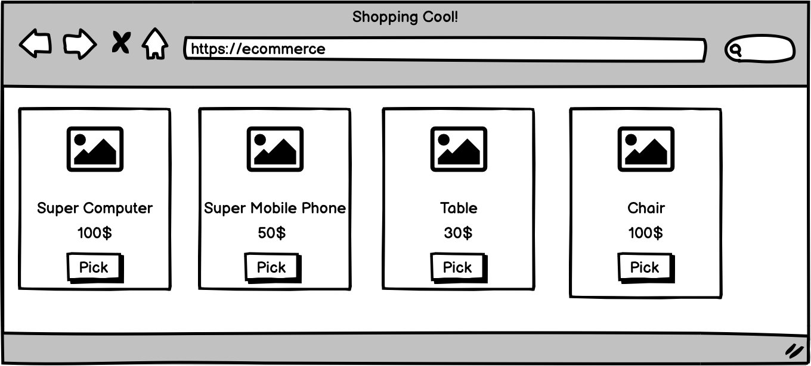
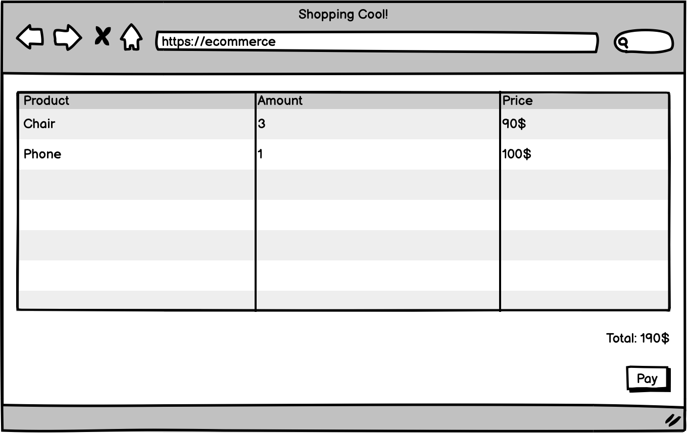

This article has an oxymoron title.

I want to tell two stories. One which make a case for don't start with Microservice, one for start with Microservice. And I believe by looking from both side of thing, we will understand more about what is the actual benefit of Microservice.

So, let's get start.

## Don't start with Microservice

Imagine you are working for a big e-commerce platform. And like all e-commerce platform, there is a product list page which show all the product. There is also a checkout page which handling a shopping cart and a checkout process.

Long time ago, John, CTO of this company read something about Microservices. John thought that this is a great idea. So John decided to have a Microservice which responsible for Product list domain, and Shopping Cart domain.

The microservices architecture allow John to have a product list team and a checkout team. Both of them have their own business objectives, metrics, KPI, SLA and so on. Both team is a cross functional team which responsible for product list page end-to-end.

Each of them can go wild with what they want to do. For example, checkout team can implement their own AB Testing with multiple localization and a nice holiday theme on top of it. Product team can focus on optimize the product list by suggesting relevant items. Both of them can focus on their area without being afraid of making a breaking changes to other area, as long as the backward-compatibility of API communication between domain is maintained.

Perfect, sounds good. Life is nice.

---

Next year, CEO found from some research that if show relevant product during landing page and checkout process can significantly increase sales.

> > >

## Start with Microservice

Let's move to another company, Github.

## Takeaway

Microservice architecture is a management tool. It makes some type of change significantly easier and makes some type of change significantly harder. It can be used to enable productivity in a certain area as a cost of decreased productivity in some area.

Microservice works well with certain type of management.
