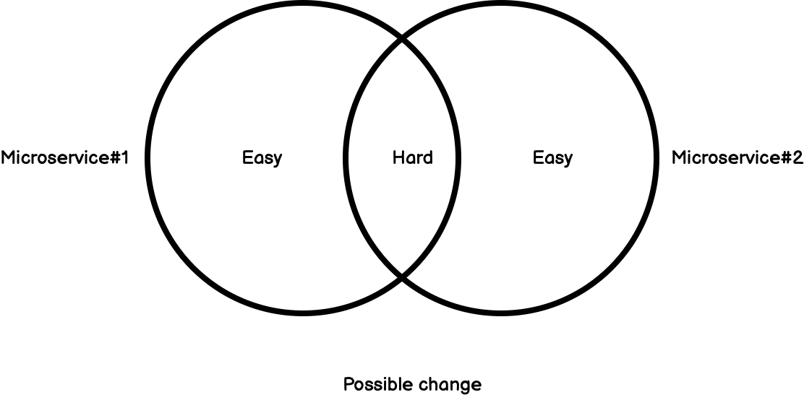

This article has an oxymoron title.

I want to tell two stories. One which makes a case for don't start with Microservice, one for start with Microservice. And I believe by looking from both side of thing, we will understand more about what is the actual benefit of Microservice.

So, let's get start.

## Don't start with Microservice

Imagine you are working for a big e-commerce platform. And like all e-commerce platform, there is a product list page which show all the product. There is also a checkout page which handling a shopping cart and a checkout process.


A long time ago, John, CTO of this company read something about Microservices. John thought that this is a great idea. So John decided to have a Microservice which responsible for the Product list domain, and Shopping Cart domain.

The microservices architecture allows John to have a product list team and a checkout team. Both of them have their own business objectives, metrics, KPI, SLA and so on. Both teams are cross-functional teams responsible for the product list page and checkout process end-to-end.

Each of them can go wild with what they want to do. For example, the checkout team can implement their own AB Testing with multiple localization and a nice holiday theme on top of it. The product team can focus on optimizing the product list by suggesting relevant items. Both of them can focus on their area without being afraid of making breaking changes to other areas, as long as the backward compatibility of API communication between domains is maintained.

Furthermore, we can partially scale the system. Let say we have a big Friday promotion, the customer will browser products and promotions a lot more. We might need a much bigger Product list backend while a little bit bigger checkout page.

Perfect sounds good. Life is nice.

---

Next year, Jane the CEO want to have a promotion sales. Jane also figured out from some research that if show relevant products on the landing page and during the checkout process can significantly increase sales.


There are some specific pricing scheme, relevancy (a customer who buy a lot of IT-related items get more discount on IT items), and customer privileged classes. These should be managed by the product list team since they have done much research on how to display relevant attractive products. Also, the product list team know exactly how to show the product in an attractive manner. They know exactly what color, font, image size and margin yield the best conversion rate.

However, this change going to be tough.

Since both the backend and the frontend for the Checkout process and product page belong to different microservice, so we need to share code, design, logic, etc. between both teams. We can do a simple copy-paste, we can create a shared library, we can expose some kind of API.

While those are all technically possible, implementing this change requires significant in this microservices architecture required significantly more effort compared to a monolith architecture.

And what if we need to iterate the design, data, and everything in promotion? Every change in each iteration must be reflected on both the checkout page and product list page. If we don't do it right, we will need to double all the work or keep redesigning API between these two teams again and again.

---

Once we use microservice architecture, we essentially make **any change within service become easier**, while **a change across services become harder**.



Since we as a human are bad at predicting future, we should never start with microservices. We don't know what business going to expect from us 6-12 months down the line. However we split microservice, it is likely to be wrong.

Let's never start with Microservice.

## Start with Microservice

Let's rewind back and see how things can go differently.

John, CTO of this company read something about Microservices. John thought that this is a disastrous idea. Everything Microservices technically solve can also be done with Monolith, so why add distributed part into the equation? Most of our programmers will suffer from [the fallacies of distributed computing](https://en.wikipedia.org/wiki/Fallacies_of_distributed_computing).

John insisted on using Monolith architecture.

John has a team of around 30 developers. At this scale, it is not possible for John to take reviewed every single change to his big monolith. So he checked the code once in a while.

The company took the opposite direction: They want to implement a single **Buy now!!** button, which essentially is a single-step checkout.


Since this is obviously on the Product List page, so stakeholders ask the Product List team to develop it. One of the developers looked at the requirement. They thought that since this page is all about the product, we should implement it in a product class like this.

```Java
class Product {
    public void CheckoutWithOneClick() {
      this.PaymentService.Pay(this.Price);
    }
}
```

From a seasoned developer perspective, this is a very very strong code smell. Somehow, this passed through code review, got check-ins, and become the main part of the monolith.

---

Six months later, everything relate to checkout become really hard to implement and buggy. If we want to be able to apply promo code, we need to remember that there are one-click checkout implemented in a product class. If we want to provide a discount for a special class of customers, we also need to remember this as well. There were many instances where the checkout team was asked to implement some sophisticated checkout scheme, and it does not work well with this one-click button.

Feature development, bug fixes and everything related to the checkout process was implemented separately. And since Product Team own the `Product` class and Checkout team own the `CheckoutService`, each team interpreted requirement a little bit differently and implement business logic a different way. One might check for promo code first and the other might check for customer privileged first and so on.

John saw this once it is too late. There are many code duplications and separate logic branches between `CheckoutWithOneClick` and the normal checkout process. It would take quite a significant investment to refactor this piece of code.

At some point, John was fired and Jane hired a new CTO.

The first question Jane asked was: Why is it so hard for us to do anything in the checkout process?

New CTO: Well, there is a different logic implemented in one-click checkout and normal checkout. This makes it hard to do anything in the checkout process.
Jane: How did this happen?
Random Engineer in the team: Everyone know about this. It's started by one of the developers decide to have separate logic for one-button check-in. That's bad, but I don't know how John could do it better. He could not possibly check every piece of code.
**New CTO: Well, John should have started with Microservice. That way, the product list team would never be able to come up with this design. They would be blocked by Checkout team service ownership.**

## The value of Microservice

Well, John was in a weird situation. Doom if he used Microservice, also doom if he didn't.

Because essentially, Microservice is a management tool.

Microservice prevent some type of changes and enable some type of changes to be easier.

In the first example, the Microservice architecture prevents desirable changes. In the second example, the lack of Microservices architecture enables an undesirable set of changes.

That is why John is doomed either way. The problem is not about Monolith vs. Microservice. The problem is about architecture choice misalignment with business growth.

Well, you can argue that in the second story John can work harder and make sure all the code have design review and throughout audit and etc. But that's the point. That's management solution can be costly and add a lot of overhead into the development process.

Microservice can reduce that cost by making it inherently hard to mess the design up. But when we actually want to mess the design up for a good reason, well... you got the scenario in the first story.

In the end, the architecture must align with business growth. That is all to it.

When you use microservice, you enable some set of growth to be easier and simultaneously disable some type of growth to be harder.

If you have a checkout microservice, the checkout team would be able to churn out new features much faster. They can release on their own. They can use a programming language they prefer. They don't depend on the other team. They can manage the scalability of their service independently.

That is, what I believe, the core benefit of microservice architecture.

Every technical aspect of Microservice, such as independently scale some part of the system or using multi-language implementation, can be solved using Monolith. You can use a build and configure it to open a specific endpoint for some containers and there you go independently scaling just a part of the system. You can use cross-process communication at the OS level and manage binary distribution and there you go, multi-language implementation. The latency might be even better than the network.

What Monolith cannot solve is when you want to have a certain type of management structure and incentivize growth and creativity in a certain area by giving autonomy and a frequent independent release cycle. That is what really really hard to do in Monolith architecture.

So I would say the deciding factor for Microservice implementation: Is it aligned with how your organization want to grow?

Because again, Microservice essentially is a technical solution to the management problem. And it is a real problem that requires a good solution.

If you think it is a stupid management problem, well I invite you to try solve that. If you can solve just a simple question of "how to make programmers collaborate effectively?" in a scalable and repeatable way, I believe you have the potential to be richer than Jeff Bezos.

Amazon has been working on this. Google has been working on this. Facebook has been working on this. Every behemoth tech company in existence have been working on this for decades and they came up with Microservice stuff. If you have a better answer, then go ahead, let me and all those guys know. They are ready to invest.
