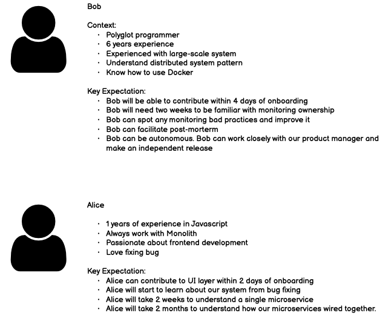
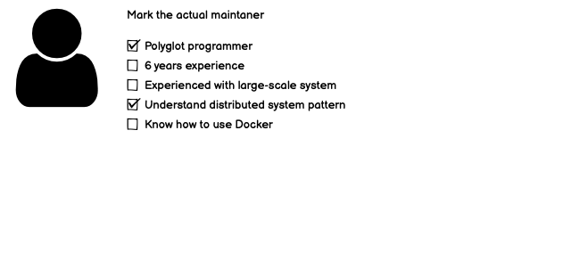
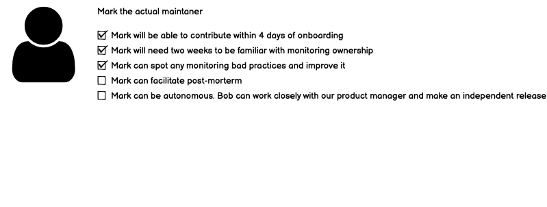

We developers always dream about a maintainable system. We longed for a simple system that is easy to work with. It should be easy to change, debug and observe.

We created a concept called clean code and clean architecture in order to pursue that dream.

What is clean architecture? There is a definition defined by [Uncle Bob](https://blog.cleancoder.com/uncle-bob/2012/08/13/the-clean-architecture.html). It must be independent of a framework. It must be independent of UI, etc.

Everything seems good. Since we have a solid ground on what a clean code is, we should already achieve a maintainable codebase, right?

Surprisingly, whenever I had a conversation with developers who work with those clean architecture patterns. I asked them how it is in practice. Does the team become more effective? Do the team happy with the codebase?

The answer usually goes like this.

> "Well, it is not really easy for a common developer. They need to learn multiple concepts and take a lot of time to become effective."

Wait. In a quest to chase a maintainable codebase, we accidentally created a codebase that is hard to maintain, did we?

### Practical maintainability

Personally, I have no issue working with great architectural patterns such as [Hexagonal Architecture](), [CQRS](), [Flux](https://facebook.github.io/flux/) [Microservices](). I learned about this pattern for quite a while.

But when I work in a team of 10 developers, does it matter if I am the only one out of nine who knows about it?

We know that a maintainable codebase must have dependency inversion, low coupling, high cohesion, follow SOLID principle, follow DRY principle, etc. Surprisingly, when we follow all the maintainable codebase rules and at the end, the team might find it hard to work with.

What happens? Are we chasing an illusion of a maintainable codebase? Are we a bunch of sheep that blindly follow the shepherd rules with false hope of promised maintainable land?

I think when we follow all those rules and theories, we achieve theoretical maintainability. Any codebase with all those characteristics should be maintainable, in theory.

In practice, I think maintainability should simply be defined like this.

> A maintainable codebase is a codebase that a team can effectively work with.

That's it—such a simple definition.

All those rules about dependency inversion, coupling, cohesion, SOLID, DRY are just tools to achieve the dream. We should understand those concepts in order to create a maintainable codebase. But they should never be viewed as a goal in itself.

Is the CQRS codebase maintainable? If a team finds it easy to work with, then yes.

In the end, the maintainability of any codebase never depends on whether you do things in the right way or follow best practices. While it helps, it is not a deciding factor.

It all depends on **humans**. Yes, those fuzzy emotional unreliable humans.

### Working with human

> Once, a software architect said this to me: Software Architect is a very special role. We are responsible for the overall quality of the codebase. We know the quality of the codebase depends on developers. And yet, we don't have any power to hold those developers accountable. We can only design, convince, and maybe set some rules.

A path toward maintainable architecture is such a vague path. Since it all depends on humans, there is no correct answer. No matter what you do, you might be right, or you might be wrong.

Software engineers are familiar with working with binary. There will always be a right way. Code should either compiled or error. Code should either pass a test or fail a test. Everything should be consistent and reproducible.

On the other hand, humans are not consistent at all. Today a human can love one thing, and tomorrow they might hate it. They might say our codebase is the best codebase ever today, and in the next few months, they might want to rewrite everything from scratch.

How can we work with humans?

I would like to introduce you to two fields that are pretty much in the same spot.

The first field is the design field. Designers never have direct control over users, yet they need to design both UX and UI to guide users to do the right thing. Their career pretty much depends on the user doing the right thing while still happy with the overall experience.

The second field is the economic field. Economic planners never have direct control over the population behavior, yet they need to create a system that incentivizes people to a certain economic direction. Otherwise, the whole nation failed.

I am always fascinated by behavioral economics. How can you introduce a policy? How will people react to that? What will be the consequence?

There are many tools and ways of thinking from those fields that we can apply to software architecture. I can name many. Design thinking, User testing, Unintended consequence, Game Theory, etc. All those tools are applicable to software architecture.

And today, I will write about a tool that I steal from the design field: **Persona**

### Persona

According to Wikipedia, here is a definition of persona

> A persona (also user persona, customer persona, buyer persona) in user-centered design and marketing is a fictional character created to represent a user type that might use a site, brand, or product in a similar way

Basically, whenever designers design anything, they create a fictional character of their user. And we can adopt this practice of creating a fictional character of maintainers.

There are many ways to create a persona in product development. To get back to software architecture, I think persona of maintainers should consist of two parts:

- Context. What is the experience level of our fellow developers? What is their role? What will they do on a day-to-day basis?
- Expectation. Based on context and our design, what are our expectations?

The context helps you empathize with the capability, limitation, and habit of maintainers. That will be an architectural design constraint. On the other hand, expectation helps you understand what you expect from each.

For example, let say we want to adopt microservice architecture. Here is a persona example:

We might start with either the context side or the expectation side. We might start by asking ourselves: here what I want from our maintainers. What kind of people are they? Or you might start by: here are our maintainers. What can I expect? It works both ways.

Just by writing down persona, we make a connection between maintainer and expectation clearer and more realistic.

### Persona testing: Context side

Once you have persona, you need to test your persona.

It is very simple. We just look at actual maintainers and see if they fit the description.

In this case, we identify the gap between the actual maintainers and our ideal maintainers. Mark doesn't have 6 years of experience, but he understands distributed systems.

Once all gaps are clearly identified, we have many choices to deal with them.

Aside from a clear choice of changing our architecture to fit the maintainers, we can also provide a training and capability improvement program. We can switch some team members around with other projects. We can hire someone from the outside that matches a requirement.

We can even set a standard and career development. We can bring your persona to all those junior and say: We want you to be this person within a year. Once you obtain these, we can talk about promotion and next step in your career.

All of the above are some examples of what we can do once gaps are clearly identified.

I hope you now see the value of writing down persona.

There is one thing I want you to be prepared. Seeing these gaps might lead to some hard conversations, and we might not feel comfortable about these.

All I can say is that this approach works much better than design for the best and pray for the rest approach. It works much better than blindly adopting microservice, and in the end, all maintainers just want to quit or kill the project.

I heard this kind of story so many times. Architecture implements fancy architecture and creates a big gap between what should happen and what actually happens.

Those gaps will not go away just because we don't think about it. So let us be mentally prepared and confront those gaps heads-on.

### Persona testing: Expectation side

As we adjust our context, we still might be wrong about expectations.

For example, we might think that our maintainers can independently create new feature. We might think that a senior developer will be able to facilitate post-mortem.

In the end, we might be wrong.

When you have expectations and context written down, it opens up an opportunity to improve.

Maybe our maintainers need more training and knowledge than we initially thought. Perhaps the way we separate our domain does not enable our maintainer to contribute. Maybe our maintainers are stuck in some legacy process or legacy code that we don't know.

There are many possible causes and possible solutions. As in product development field said, we will never get our assumption right until we launch a product into the market.

And that is ok.

When we know exactly where we wrong, we can make it right.

It is better to say

> _I thought microservice was going to allow the team to be autonomous. It turns out that they still depend on many external services. We need to bring those services back together and rethink how we draw our domain boundaries._

than

> _We tried, and Microservices just does not fit us._

Also, it is better to say

> _I thought a programmer with 6 years of Java development experience which demonstrates capability in OOP should be able to handle this. That is where I am wrong. It seems that the Java experience is irrelevant here. We need someone who understands how the distributed system works to maintain this system._

than

> _We need better programmers to maintain this system. Please hire only top class programmers._

And personas allow you to say these types of sentences with confidence.

Whether the path forward is to change our architectural decision or improve maintainers' capability, it is much better to be explicit.

And it is ok if you don't optimize your architecture for maintainers, as long as you make it clear why and what do you expect instead.

With persona, you have a clear message to all stakeholders about what you expect. You can have a meaningful conversation on how to adjust according to hiring and capability limitation.

## Side Benefits

Aside from a software architecture perspective, having a clear persona can be a tool to connect many aspects of software engineering management.

- Hiring - What is a job description? Persona!
- Career growth - How shall we set junior developer expectations? Persona!
- Capability building - What kind of training should we provide this year? Persona!

I was in a position of tech lead who responsible for both management and architecture, and having a persona in mind helps a lot.

## Endnote

Today, I introduce the concept of practical maintainability. And I think software architects should strive for it.

When it comes to practical maintainability, it's all about real humans rather than rules, processes, and practices.

In the software engineering field, we mainly focus on binary and concept. In some other fields, they have many tools to deal with human inconsistency. We can learn a lot from them.

To be successful in software architecture design, you rely on humans. Persona is one of many tools to help you layout dependency between your structure and human behavior. Persona testing helps you understand how your design actually works in practice.

Once you have everything visualize, you have the power to solve it.

I believe that just like every other type of architect, a software architect is supposed to solve a human problem. Architecture should serve human needs, not the other way around.

Thanks for reading!
