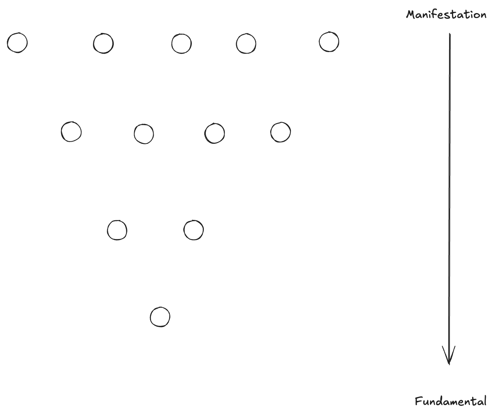
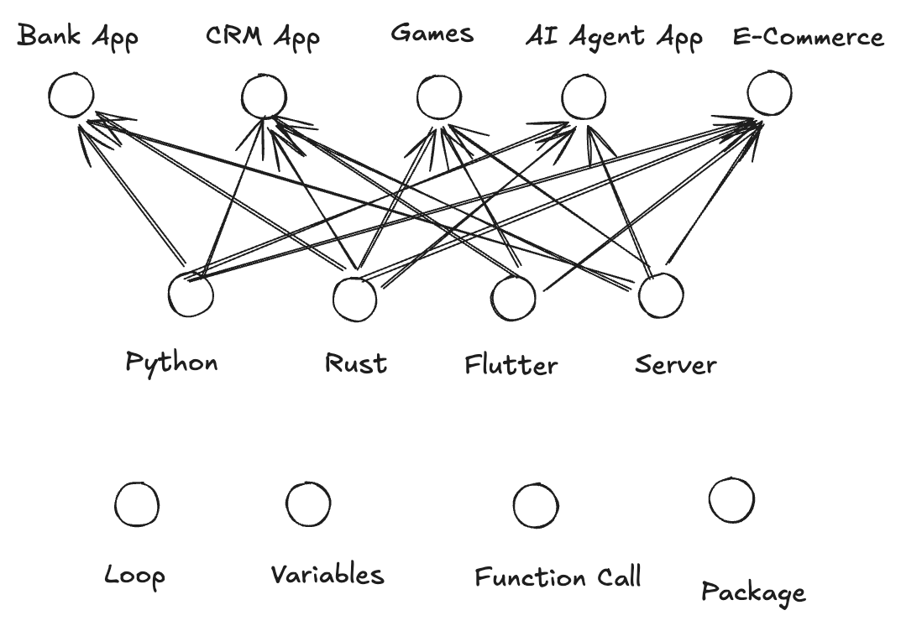
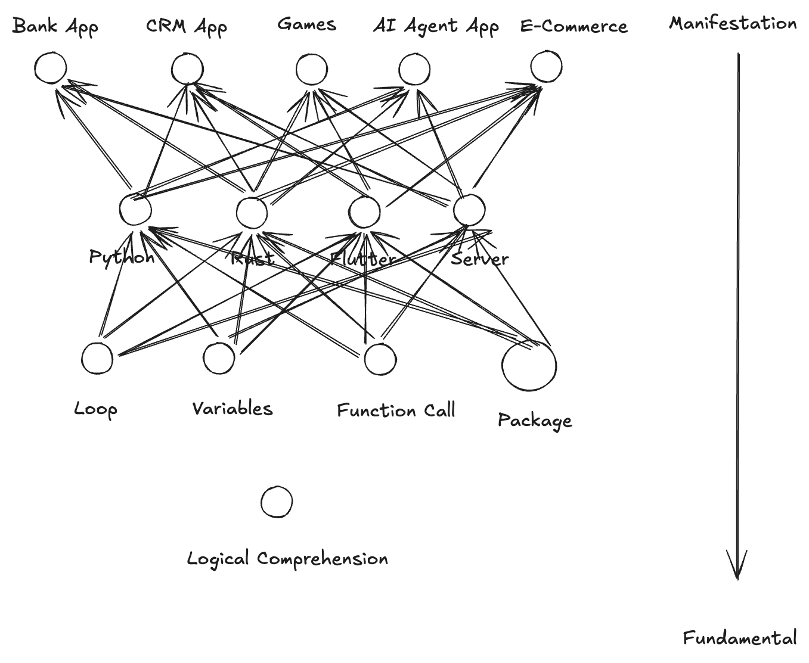
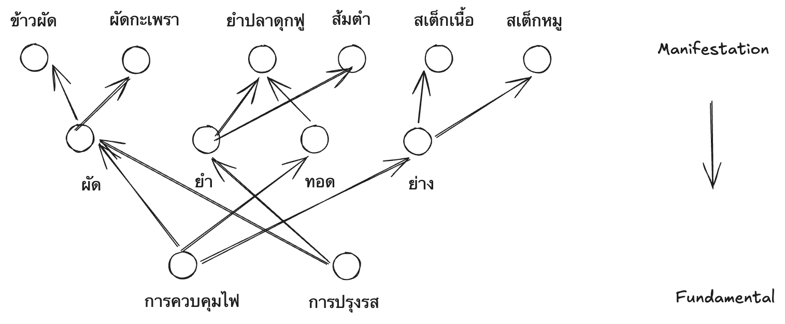
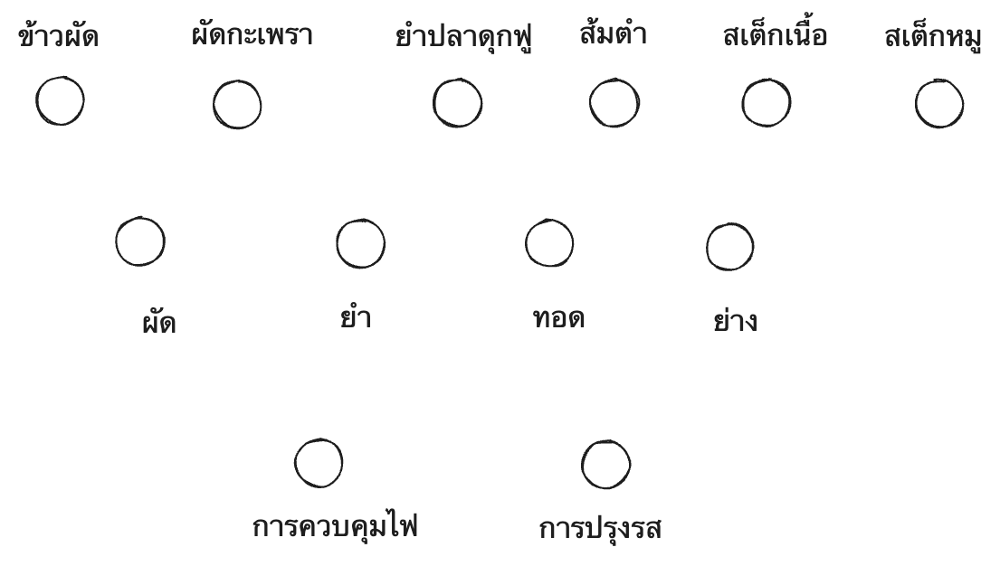
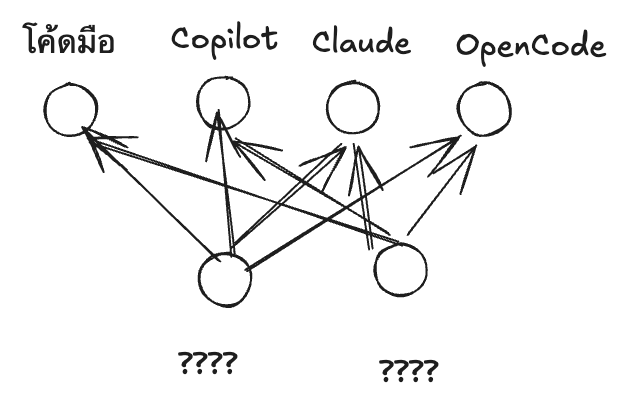
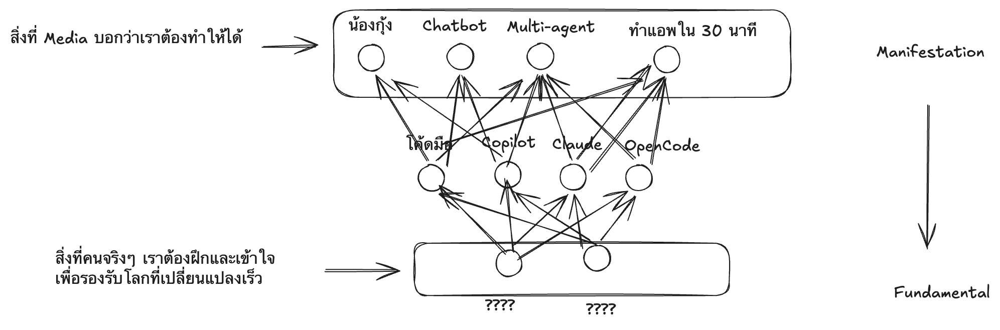

ในเวลานี้เราหลายคนต่างบอกว่าโลกกำลังเปลี่ยนกันไปเร็วมาก Fundamental เป็นสิ่งสำคัญ

แต่ผมก็ได้ยินหลายๆ ศความเห็นที่แตกต่างกันมากมายว่าอะไรคือ Fundamental กันแน่

ในโลก Programming ผมเห็นหลายคนบอกว่า Hardware คือพื้นฐาน ซึ่งผมก็ว่าอาจจะใช่ แต่ก็อาจจะไม่ใช่ก็ได้นะ

ในบล็อกนี้ผมจะพยายามอธิบายว่า Fundamental คืออะไรกันแน่ แล้วทำไมมันถึงยากนักที่จะเรียน

---

ผมมองว่าโลกเราเนี่ย ทักษะต่างๆ มันถูกประกอบร่างตามแผนภาพข้างล่างนี้ครับ

ด้านบนมันคือ Manifestation หรือทักษะที่เกิดขึ้นจริงที่ได้งานเป็นชิ้นเป็นอัน ได้งานที่เป็นที่ปรากฎในโลก Physical World สามารถใช้ได้ จับต้องได้

ส่วนด้านล่าง ยิ่งลงไปข้างล่างเท่าไหร่ ยิ่งเป็น Fundamental มากขึ้นเท่านั้น

สมมติผมยกตัวอย่างในโดเมนของการเขียนโปรแกรม

ในระดับบน หรือระดับ Manifestation เนี่ย มันคือ Application ที่เราใช้ๆ กันอยู่ทุกวันนี้ ซึ่งมันคืองานที่เราอยากได้

แต่ในระดับล่างลงมา ถ้าสมมติเราเข้าใจ Python เราสามารถทำ Application ได้หลายตัว รู้จัก Rust ก็สร้างได้หลายตัว

จะเห็นว่าทักษะในการเขียนโปรแกรมในภาษาหนึ่ง สามารถทำให้สร้างระบบได้หลายแบบ

ซึ่งทักษะพวกนี้แหละที่เราเรียกว่า Fundamental กว่าระดับบน

คือถ้าคนมีทักษะแบบผิวๆ จะเป็นทักษะในการสร้าง App ตัวเดียว แล้วจบ สร้างอะไรไม่ได้อีกแล้ว อันนี้เรียกว่าไม่มีพื้นฐาน

ถ้ามีพื้นฐานลึกขึ้น เช่น เขียนโปรแกรมภาษาหนึ่งได้ (ผมขอไม่เอา AI เขียนแทนมาพูดถึงก่อนนะ) มันก็สร้างได้หลายแบบมากขึ้น ไม่ได้ล็อกติดอยู่กับสิ่งเดียว

และถ้าผมไประดับลึกขึ้นละ ทักษะแบบไหนล่ะที่ทำให้เราสามารถเขียนโปรแกรมได้หลายภาษา

เราจะเห็นว่าไม่ว่าจะเขียนโปรแกรมภาษาใดๆ การที่เราสามารถใช้ Loop, Variable, การเรียนฟังก์ชั่นข้ามกัน, การส่ง Parameter, และระบบ Package ได้ ต่างสำคัญหมด

และถ้าผมไล่ลึกลงไป ก่อนจะเข้าใจ Loop, Variable ก็ต้องเข้าใจโลจิกพื้นฐานและการใช้โลกจิกก่อน

## Fundamental dilemma

ปัญหานึงที่ผมจะพูดถึงว่าทำไม Fundamental มันดูเป็นเรื่องไม่ค่อยมีคนให้ความสำคัญ เพราะเราต้องยอมรับความจริงข้อหนึ่งว่า

**Fundamental อย่างเดียวไม่สามารถสร้าง Manifestation ได้**

การที่จะแปลงจากความรู้ในระดับ Fundamental มาสู่ Manifestation มันจำเป็นต้องมีการเสริมทักษะบางอย่าง พื้นฐานอย่างเดียวไม่พอในตัวมันเอง ถ้าผมยกตัวอย่างง่ายๆ ก็อย่างเช่น

- คุณสามารถเข้าใจ Loop, Variable ในทางคณิตศาสตร์ แต่เขียนโปรแกรมไม่ได้เลยซักกะภาษา เขียนได้แต่ Flowchart ก็เป็นได้
- คุณสามารถเข้าใจ Python, Rust, etc แต่สุดท้ายสร้าง App จริงๆ ไม่ได้ซักกะแอป

ซึ่งในระดับการทำงานจริง แน่นอนคนจ้างงานเขาสนใจ Manifestation มากกว่า คือเราจะลึกขนาดไหนก็เรื่องนึง แต่สุดท้ายแล้วคำถามคือทักษะของเราสามารถ Manifest ออกมาเป็นอะไรที่มีประโยชน์อย่างไรกันแน่

ดังนั้นมันจึงมี Dilemma ที่ใหญ่ตัวนึง คือ ถ้าเรารู้จักแต่ Fundamental ที่ลึก เราจะแค่ "มีโอกาส" ที่จะสร้าง Manifestation ใหม่ๆ ได้เยอะ แต่เราแค่ "มีโอกาส" แต่ไม่ใช่ "ทำได้จริง"

แต่ถ้าเรารู้จักแต่ Manifestation อย่างเดียว เราจะทำได้แค่สิ่งเดียว แล้วพอโลกเปลี่ยนความต้องการเปลี่ยน เราตายไปเลย

เพื่อให้เห็นสิ่งนี้ชัดขึ้น ผมอยากพาไปสู่ Domain ที่มันเห็นชัดที่สุด ก็คือการ "ทำอาหาร"

ในระดับ Manifestation ก็คือระดับที่ออกอาหารมาเป็นจานๆ ให้เราทานแล้ว อย่างเช่น ข้าวผัด ผัดกะเพรา ยำ ส้มตำ และอื่นๆ

แต่ภายใต้อาหารนั้นมีทักษะพื้นฐานกว่านั้นอยู่

การทำอาหารอย่างผัดกะเพรา หรือข้าวผัด จำเป็นต้องมีทักษะพื้นฐานอย่างการผัด การทำสเต็กต้องมีการย่าง

และพอลงไปพื้นฐานกว่านั้น ก็มีการปรุงรส หรือการใช้ไฟ

และเราก็จะเห็นว่า บางคนสามารถทำข้าวผัดได้ ก็ไม่ยากอะไร มี Recipe ที่คุณยายมอบให้มาตั้งแต่ต้นตระกูล ต้องใช้อะไร เท่าไหร่ คลุกนานขนาดไหน ทำตามขั้นตอน จบ ได้ข้าวผัดอร่อยมาก ตามตำรับตระกูลโบราณ

แต่เข้าอาจจะทำผัดแบบอื่นไม่ได้เลย ทำได้แค่ตามสูตรนี้สูตรเดียว ถ้าเขาไม่มีทักษะพื้นฐานในการ "ผัด"

หรือบางคนทำได้แต่ผัด แต่ไม่สามารถทำอาหารแบบอื่นอร่อย เพราะไม่มีทักษะในการใช้ไฟ จัดการกับวัตถุดิบ

แต่คุณจะเห็นอะไรมั้ยว่า ในทางตรงข้าม ทักษะในการจัดการกับวัตถุดิบ เช่น รู้ว่าเนื้อใช้ไฟเท่าไหร่ดี หั่นอย่างไรดี ไม่สามารถสร้าง Manifestaion แบบ "ผัดกระเพราเนื้อ" ได้เลย จนกว่าจะมี Recipe ตามมา

แล้วเราอยากได้เชฟที่เก่งการจัดการวัตถุดิบ แต่ทำกะเพราเนื้อออกมาให้เรากินไม่ได้มั้ยล่ะครับ

## ปัญหาของวิธีมอง Skill-based learning ในปัจจุบัน

เนื่องจากผมมีส่วนร่วมในการพัฒนาทักษะในองค์กร และการทำคอร์สสอนของตัวเอง ผมขอพูดเรื่องนึงว่าเวลาเราเรียนหรือเสริมสร้างทักษะพื้นฐาน วิธีมองที่คนส่วนมากใช้กัน มักจะมีหล่มใหญ่ที่ติด

คือ ปัจจุบัน ทั้งนักเรียน ผู้สอน หรือแม้แต่คนวางแผน Training ในองค์กร มักจะมองทักษะในลักษะเป็นชิ้นๆ แบบนี้

คือเราจะถามตัวเองว่าเรามีทักษะนั้นทักษะนี้ครบมั้ย แต่สิ่งที่เราตกไปคืออะไรรู้มั้ยครับ

มันคือ "เส้นเชื่อม"

เรามีจุดเป็นก้อนๆ ที่เราต้องเรียน แต่เราเรียนเป็นขยักๆ เป็นชิ้นๆ โดยไม่มีเส้นเชื่อมกลับมา

พอเราบอกว่าให้ไปเรียนพื้นฐานอย่าง เรียนการจัดการวัตถุดิบ แต่เราลิงก์กลับมาไม่ได้ว่ามันจะช่วยให้ทำผัดกะเพราดีขึ้นได้ยังไง หรือจะช่วยให้ทำอาหารจานใหม่ได้ยังไงบ้าง

พอเราบอกให้ไปเรียนพื้นฐานอย่าง การทำงานของ Hardware แต่เราลิงก์กลับมาไม่ได้ว่ามันจะช่วยให้การสร้าง Application ดีขึ้นได้ยังไงบ้าง

มันก็กลายเป็นทักษะลอยๆ อยู่ในอากาศ ที่ไม่ได้ทำให้เกิดผลงานอะไร

แม้แต่การสร้างแผนภาพ Logical ที่ผมทำในบทความนี้ เป็นทักษะที่ประยุกต์ได้เยอะมาก และผมประยุกต์จากทฤษฎี Category Theory

และรุ่นพี่ที่สอน Category Theory ให้ผมได้บอกสิ่งที่สำคัญที่สุดที่ผมจำถึงทุกวันนี้ว่า

**ลูกศรและเส้นเชื่อมสำคัญกว่าจุด**

ปกติแล้วเวลาผมสอน ผมจึงใช้เวลาเยอะมากในการสร้างเส้นเชื่อมจากสิ่งที่ผมสอนมาสู่ Manifestation บางอย่าง

---

และถ้าเราเข้าใจแผนภาพดังกล่าวแล้ว เราจะเข้าใจอีกข้อนึง

**เวลาเรียนหรือสอนพื้นฐาน จะให้เห็นประโยชน์ ต้องเชื่อมให้เจอ Manifestation มากกว่าหนึ่งตัว**

ใช่ครับ การเรียนระดับ Fundamental เนี่ย เราจะเรียนไปทำไม ถ้ามันใช้ได้กับ Manifestation แบบเดียว

อันนั้นมันไม่ใช่เรียนพื้นฐานแล้ว มันเรียนสูตร

(และใครเรียน Humanistic Architecture กับผม น่าจะเข้าใจแล้วว่าทำไมตอนทำ Workshop สุดท้าย เราถึงต้องมี CTO อย่างน้อยสองรูปแบบให้เล่นกัน ใครเรียน Culture Building กับผมมา น่าจะเห็นว่าทำไมผมจำเป็นต้องจัดทีม 4 Culture แบบในแต่ละโต๊ะให้ดูเปรียบเทียบกัน)

ดังนั้น ถ้าถามว่าทักษะขั้นพื้นฐาน Fundamental คืออะไรกันแน่ ผมจะตอบว่า

Fundamental คือทักษะใดๆ ก็ตามที่

1. ตัวมันเองไม่สามารถสำเร็จงานได้
2. ตัวมันเองมีส่วนช่วยเหลือให้สามารถสำเร็จงานได้มากกว่า 2 แบบเป็นต้นไป

ซึ่งผมเชื่อว่าทักษะ "Fundamental" พวกนี้เรามีกันหมดแล้ว ทันทีที่เราสำเร็จงานได้หนึ่งชิ้น มันจะมีพื้นฐานบางอย่างที่เราต้องใช้ด้วยเสมอ

แต่แค่เราอาจจะไม่เคยโฟกัสหรือย่อยมันออกมาฝึกเฉพาะ

คือผมเอาตัวอย่างง่ายๆ นะ คนทำผัดกะเพราได้ ต่อให้ทำตามสูตร เขาก็ผัดเป็นแล้ว

แต่ขึ้นอยู่กับเขาจะฝึกส่วนของ​ "การผัด" มากขึ้น เสริมสร้างพื้นฐานมากขึ้น

หรือฝึกการทำกะเพราจานเดียวซ้ำไปซ้ำ 1,000 รอบ จนเป็นเจ้าพ่อแห่งการทำกะเพรา

อันนี้มันอยู่ที่เขา และไม่มีคำตอบชัดเจนว่าอะไรดีกว่าอะไร ขึ้นกับชีวิต และสถานการณ์ของโลกใบนี้

## แกะว่าอะไรเป็น Fundamental กันแน่

โอเค กลับมาในโลกทุกวันนี้ที่ AI กำลังจะแย่งงานทุกคนโน่นนี่นั่น ต้องเรียนพื้นฐานกันแล้ว แล้วโอเค พื้นฐานที่ว่ามันคืออะไรนะ

ผมไม่มีคำตอบตายตัวให้ ไปคิดกันเอาเอง

แต่ผมจะบอกว่า คุณสามารถแกะได้ด้วยตัวเองว่าพื้นฐานคืออะไร

เรื่องนี้ผมขอกลับมาที่โดเมนที่ผมเชี่ยวชาญ คือการเขียนโค้ด

คำถามง่ายๆ เลยคือ อะไรกันนะ ที่เขียนโปรแกรมด้วยโค้ด กับเขียนโปรแกรมด้วย AI มันยังไม่เปลี่ยน ยังต้องรู้และเข้าใจเหมือนเดิม

อะไรกันนะ ที่ไม่ว่าจะสร้างโปรแกรมด้วยวิธีไหน มันยังไม่เปลี่ยนอยู่

อย่างน้อยที่ผมเห็นๆ นะ

- ทักษะในการอธิบายสิ่งที่ตัวเองต้องการได้
- ทักษะในการทดสอบว่าระบบทำงานได้ตรงที่ต้องการมั้ย
- ทักษะในการจัดการ Iteration เวลาเราปรับโปรแกรมไปเรื่อยๆ
- Versioning management

พวกนี้ผมเห็นว่ามันยังไม่ได้หายไปไหนเลย และเป็นพื้นฐานเสมอ

แต่แน่นอน ทักษะเหล่านี้เราต้องไปรวมกับ Tool และ "ลูกศร" บางอย่าง เราถึงจะสามารถสร้าง Manifestation ได้

เรื่องที่สำคัญเลยคือ ถ้าเราอยากเข้าใจพื้นฐานเพื่ออยู่ บางครั้ง Media จะให้ความสำคัญกับ Manifestation ซึ่งทำให้เราพยายามฝึกหรือทำงานกับ Layer นั้น

แต่จริงๆ มันต้องทำงานกับ Layer ล่างต่างหาก

ซึ่งจากที่ผมบอกตอนแรก

คุณมีทักษะพื้นฐานเหล่านี้อยู่แล้ว แต่คุณอาจจะไม่ได้ฝึกเฉพาะกับมัน เหมือนคนที่สนใจการทำกะเพราซ้ำไปซ้ำมาพันรอบ มากกว่าฝึกการผัดอาหารหลายๆ รูปแบบ

คุณเขียนโปรแกรมได้ คุณก็ใช้ Loop เป็นอยู่แล้ว แค่คุณอาจจะไม่เคยฝึกโฟกัสกับการทำลูป ว่าลูปแบบไหน Performant แบบไหน Maintain ง่าย อะไรแบบนี้ แต่ไปโฟกัสกับการทำระบบแบบเดียวให้ได้มากกว่า

ซึ่งไม่ผิดอะไร มันแค่ขีึ้นอยู่กับจังหวะเวลาของชีวิตคุณ และสถานการณ์ของโลกใบนี้

และอีกข้อ

ถ้าคุณเข้าใจว่าคนภายนอกสนใจ Manifestation แต่เราสนใจ Longevity และ Sustainability ของ Career เรา

เราจะเข้าใจว่าทำไมสิ่งที่เราต้องฝึกฝนหรือทำความเชี่ยวชาญ มันจะอยู่ที่ Layer ล่าง ระดับพื้นฐานกับลูกศรเป็นหลัก แล้วปล่อยให้ Manifestation เป็นแค่ผลพลอยได้ไป

ซึ่งพอโลกเปลี่ยนแปลงและเรียกร้อง Manifestation ใหม่ๆ ตราบใดที่ฐานล่างเราแน่น เราจะปรับตัวได้ไวครับ

เพราะถ้าเราสนใจแค่ระดับ Manifestation อย่างเดียว เราก็อาจจะทำสิ่งนั้นได้เก่งมากๆ แต่ถ้าความต้องการเปลี่ยนเราก็ลำบากกันไป

ซึ่งตรงนี้ ผมคิดว่าแต่ละคนต้องเลือก Trade กันเอาเอง เพราะการ "ทำได้" แต่ขยายต่อไม่ได้ ก็มีประโยชน์มีมูลค่าของมัน ขึ้นอยู่กับบจังหวะเวลาและจังหวะชีวิต ว่าเน้นอะไรอยู่

แต่ถามว่าทักษะอะไรกันแน่ที่เป็น "พื้นฐาน" ที่จะไม่เปลี่ยน

ผมอยากเชิญชวนให้ลองหาและตกผลึกกันเอาเอง ผมคงมอบให้แค่วิธีมองเฉยๆ

เพราะทุกวันนี้มีคนบอกว่า ต้องเรียนอันนั้น ต้องทำอันนี้ เยอะแล้วแหละ ผมขอเป็นคนนึงที่บอกว่า คุณเอาแค่วิธีมองไป ลองไปตกผลึกกันเอาเองดีกว่า

คุณอาจจะได้คำตอบที่ดีกว่าที่ผมคิดก็ได้นะครับ
